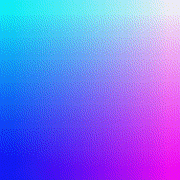
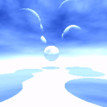
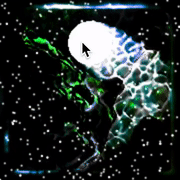
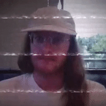
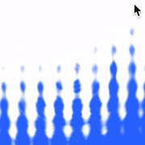

# &lt;shader-doodle /&gt;

[![Latest NPM release][npm-badge]][npm-badge-url]
[![Dependencies][deps-badge]][deps-badge-url]
[![Minzip Size][size-badge]][size-badge-url]
[![License][license-badge]][license-badge-url]

*A friendly web-component for writing and rendering shaders.*

[](https://hello-shader-doodle.glitch.me) [](https://codepen.io/pjkarlik/pen/abOVwaB) [](https://codepen.io/halvves/pen/xxGXdRv)
[](https://codepen.io/halvves/pen/abOwJbR) [](https://codepen.io/halvves/pen/WNbgvNx) [](https://codepen.io/pjkarlik/pen/yLNEoBK)
[](https://codepen.io/mhazani/pen/VwwQYvE) [](https://codepen.io/pjkarlik/pen/JjdVmqv) [](https://codepen.io/pjkarlik/pen/poJYLea)
[](https://codepen.io/halvves/pen/dyyvrxN) [](https://codepen.io/halvves/pen/VwwdQEN) [](https://codepen.io/halvves/pen/PoqGvVG)

NOTE: this README and branch are for the new `<shader-doodle />` alpha. To view the current stable version go to the [v0 branch](https://github.com/halvves/shader-doodle/tree/v0).

`<shader-doodle />` is a simple web-component loosely based on the [The Book of Shaders](https://thebookofshaders.com/)'s glsl previewer and [Shadertoy](https://www.shadertoy.com/). It sets up a flat responsive canvas on which to draw fragment shaders, and provides several built in uniforms relating to time, resolution, mouse position, etc.

## Usage

### Script Include

```html
<script src="https://unpkg.com/shader-doodle@alpha"></script>
<shader-doodle>
  <script type="x-shader/x-fragment">
    void main() {
      vec2 st = gl_FragCoord.xy / u_resolution.xy;
      vec3 color = vec3(st.x, st.y, abs(sin(u_time)));

      gl_FragColor = vec4(color, 1.0);
    }
  </script>
</shader-doodle>
```

### Import

`npm install shader-doodle@alpha`

```javascript
import 'shader-doodle';
```

```html
<shader-doodle>
  <script type="x-shader/x-fragment">
    void main() {
      vec2 st = gl_FragCoord.xy / u_resolution.xy;
      vec3 color = vec3(st.x, st.y, abs(sin(u_time)));

      gl_FragColor = vec4(color, 1.0);
    }
  </script>
</shader-doodle>
```

## API

Right now the api is fairly basic. The default syntax is vanilla glsl and there are several built in uniforms following the conventions seen in [The Book of Shaders](https://thebookofshaders.com/). If you prefer ShaderToy's syntax you can set an attribute like so: `<shader-doodle shadertoy />`.

### Pre-Defined Uniforms

#### Default (`<shader-doodle />`)

* `uniform float u_time;`: shader playback time (in seconds)
* `uniform float u_delta;`: delta time between frames (in seconds)
* `uniform int u_frame;`: shader playback frame
* `uniform vec4 u_date;`: year, month, day and seconds
* `uniform vec2 u_resolution;`: viewport resolution (in pixels)
* `uniform vec2 u_mouse;`: mouse pixel coords (x & y)
* `uniform vec4 u_mousedrag`: xy: last click or current drag position, zw: starting drag position (flipped negative when not mousedown)
* `uniform vec3 u_orientation;`: [device orientation api](https://developer.mozilla.org/en-US/docs/Web/API/Detecting_device_orientation) values: alpha, beta, gamma

#### Shadertoy (`<shader-doodle shadertoy />`)

* `uniform float iTime;`: shader playback time (in seconds)
* `uniform float iDelta;`: delta time between frames (in seconds)
* `uniform int iFrame;`: shader playback frame
* `uniform vec4 iDate;`: year, month, day and seconds
* `uniform vec2 iResolution;`: viewport resolution (in pixels)
* `uniform vec2 iCurrentMouse;`: mouse pixel coords (x & y)
* `uniform vec4 iMouse`: xy: last click or current drag position, zw: starting drag position (flipped negative when not mousedown)
* `uniform vec3 iOrientation;`: [device orientation api](https://developer.mozilla.org/en-US/docs/Web/API/Detecting_device_orientation) values: alpha, beta, gamma

_NOTE: the slight difference in mouse uniform naming_

### Textures

Textures can be used as a `sampler2D` in a shader by using the `<sd-texture />` component. This will pass in two uniforms:

* `uniform sampler2D {texture_name}`
* `uniform vec2 {texture_name}_resolution`

#### Attributes

* `src`: source of an image/video or selector for a canvas
* `name`: specify a name for the texture uniform (will default to `u_texture{index}`)
* `webcam`: overrides `src` and tries to use webrtc webcam as texture source
* `force-update`: forces a texture to always update (useful when using a canvas animation or animated gif as a texture)

#### Examples

##### Image:
```html
<shader-doodle>
  <sd-texture src="image.jpg"></sd-texture>
  <script type="x-shader/x-fragment">
    uniform sampler2D u_texture0;

    void main() {
      vec2 uv = gl_FragCoord.xy / u_resolution.xy;
      vec4 texture = texture2D(u_texture0, uv);

      gl_FragColor = texture;
    }
  </script>
</shader-doodle>
```

##### Video:
```html
<shader-doodle>
  <sd-texture src="video.mp4" name="video"></sd-texture>
  <script type="x-shader/x-fragment">
    uniform sampler2D video;

    void main() {
      vec2 uv = gl_FragCoord.xy / u_resolution.xy;
      vec4 texture = texture2D(video, uv);

      gl_FragColor = texture;
    }
  </script>
</shader-doodle>
```

##### Canvas:
```html
<canvas id="canvas"></canvas>
<shader-doodle>
  <sd-texture src="#canvas" name="u_canvas"></sd-texture>
  <script type="x-shader/x-fragment">
    uniform sampler2D u_canvas;

    void main() {
      vec2 uv = gl_FragCoord.xy / u_resolution.xy;
      vec4 texture = texture2D(u_canvas, uv);

      gl_FragColor = texture;
    }
  </script>
</shader-doodle>
<script>
  const text = 'L  O  R  E  M     I  P  S  U  M';
  const canvas = document.getElementById("canvas");
  canvas.height = 1024; canvas.width = 1024;
  const ctx = canvas.getContext("2d");
  ctx.font = "Bold " + canvas.width / 12 + "px 'Helvetica'";
  ctx.textAlign = "center";
  ctx.textBaseline = "top";
  ctx.fillStyle = '#000';
  ctx.fillRect(0, 0, canvas.width, canvas.height);
  ctx.fillStyle = '#fff';
  ctx.translate(canvas.width / 2, 0);
  for (var i = -1; i < 6; i++) {
    ctx.fillText(text, 0, i * canvas.height / 6);
  }
</script>
```

##### Camera:
```html
<shader-doodle>
  <sd-texture webcam name="cam"></sd-texture>
  <script type="x-shader/x-fragment">
    uniform sampler2D cam;
    uniform vec2 cam_resolution;

    vec2 coverScreen(vec2 fragCoord, vec2 resolution, float aspect) {
      vec2 uv = 0.5 * (2.0 * fragCoord - resolution);
      if (resolution.x / resolution.y > aspect) {
        uv = 0.5 - uv / vec2(resolution.x, -resolution.x / aspect);
      } else {
        uv = 0.5 - uv / vec2(resolution.y * aspect, -resolution.y);
      }
      return uv;
    }

    void main() {
      float aspect = cam_resolution.x / cam_resolution.y;
      vec2 uv = coverScreen(gl_FragCoord.xy, u_resolution, aspect);
      vec4 texture = texture2D(cam, uv);

      gl_FragColor = texture;
    }
  </script>
</shader-doodle>
```

### Audio Data

The frequency and waveform data from an audio source can be used in a shader as a `sampler2D` by using the `<sd-audio />` component. This will pass in one uniform:

* `uniform sampler2D {audio_name}`

The audio data is setup as two rows of texels.

The first row is frequency data. The x/u axis corresponds to frequency (scaled to 0..1), and the value of a texel at a given x/u is the amplitude of the corresponding frequency.

The second row is wave data. The x/u axis corresponds to the x axis of the waveform. (scaled to 0..1), and the value of a texel at a given x/u is the y axis of the waveform.

#### Attributes

* `src`: a url to an audio file or an id selector for an `<audio />` element.
* `name`: specify a name for the texture uniform (will default to `u_audio{index}`)
* `loop`: (_temporarily disabled as part of an ios13 fix_) loop the audio file (_doesn't work on an existing audio tag_)
* `autoplay`: (_temporarily disabled as part of an ios13 fix_) autoplay the audio file (_doesn't work on an existing audio tag_)
* `crossorigin`: (_temporarily disabled as part of an ios13 fix_) specify cors (_doesn't work on an existing audio tag_)

Not yet implemented is a `mic` attribute that will allow using audio from a webrtc source.

#### Examples

##### File:
```html
<shader-doodle>
  <sd-audio src="./audio.mp3" autoplay loop></sd-audio>
  <script type="x-shader/x-fragment">
    uniform sampler2D u_audio0;

    float amplitude(sampler2D audio, float f) {
      return texture2D(audio, vec2(f, .25)).x;
    }

    float wave(sampler2D audio, float t) {
      return texture2D(audio, vec2(t, .75)).x;
    }

    void main() {
      vec2 uv = gl_FragCoord.xy / u_resolution.xy;

      float w = wave(u_audio0, uv.x);
      float a = amplitude(u_audio0, abs(.5 - uv.y) / w);

      vec3 color = vec3(a * .5, (1. - a), 5. * a * (1. - a)) * a;
      color.rb += (1. - smoothstep(.0, .1, abs(w - uv.y))) * a;

      gl_FragColor = vec4(color, 1.);
    }
  </script>
</shader-doodle>
```

##### Audio Tag:
```html
<audio src="./audio.mp3" autoplay loop id="audio"></audio>
<shader-doodle>
  <sd-audio src="#audio"></sd-audio>
  <script type="x-shader/x-fragment">
    uniform sampler2D u_audio0;

    float amplitude(sampler2D audio, float f) {
      return texture2D(audio, vec2(f, .25)).x;
    }

    float wave(sampler2D audio, float t) {
      return texture2D(audio, vec2(t, .75)).x;
    }

    void main() {
      vec2 uv = gl_FragCoord.xy / u_resolution.xy;

      float w = wave(u_audio0, uv.x);
      float a = amplitude(u_audio0, abs(.5 - uv.y) / w);

      vec3 color = vec3(a * .5, (1. - a), 5. * a * (1. - a)) * a;
      color.rb += (1. - smoothstep(.0, .1, abs(w - uv.y))) * a;

      gl_FragColor = vec4(color, 1.);
    }
  </script>
</shader-doodle>
```

## Next steps (ordered by priority)

* shader precision attribute
* clearColor attribute
* mouseover 0-1 uniform
* LinearCopy/NearestCopy helpers
* lerp attribute for mouse, mouseover, and deviceorientation
* custom uniforms
* webgl2
* improvements to buffers (shared buffers etc...)

## See Also

* [shaderpen](https://github.com/halvves/shaderpen/) - This library's predecessor.
* [css-doodle](https://github.com/css-doodle/css-doodle) - The inspiration behind rewriting shaderpen as a web-component.
* [The Book of Shaders](https://thebookofshaders.com/) - A gentle step-by-step guide through the world Fragment Shaders.
* [Shadertoy](https://www.shadertoy.com/) - Shader playground.

[npm-badge]: https://img.shields.io/npm/v/shader-doodle/alpha
[npm-badge-url]: https://www.npmjs.com/package/shader-doodle/v/alpha
[deps-badge]: https://img.shields.io/david/halvves/shader-doodle
[deps-badge-url]: https://david-dm.org/halvves/shader-doodle
[size-badge]: https://img.shields.io/bundlephobia/minzip/shader-doodle/1.0.0-alpha.20
[size-badge-url]: https://bundlephobia.com/result?p=shader-doodle@1.0.0-alpha.20
[license-badge]: https://img.shields.io/github/license/halvves/shader-doodle
[license-badge-url]: ./LICENSE
